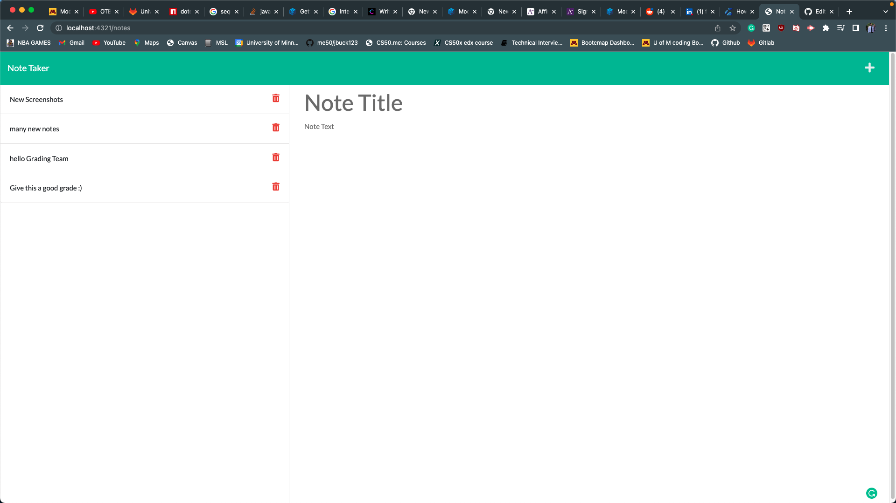
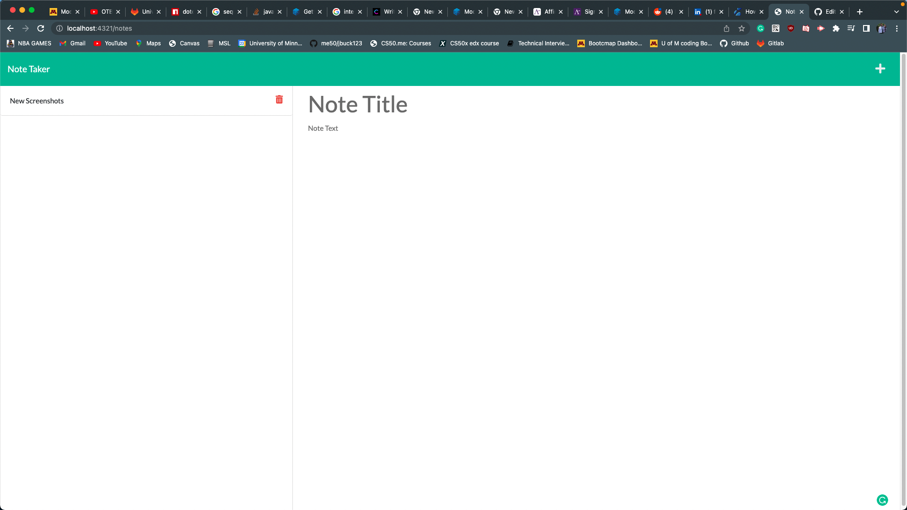

# Readme Generator
## Description
    This application takes input from the user by a series of prompts including: title, description, install instructions, usage information, contributors, licensing, and contact information.
## Table of Contents
- [installation](#installation)
- [usage](#usage)
- [Credits](#credits)
- [License](#license)

## Installation
    The user should the repo from the Github link below.
### Requirements
  -Install node
  -Install express
  -Install uuid

## Usage 

## credits
    Solo project by James Buchmann
### License MIT

    Permission is hereby granted, free of charge, to any person obtaining a copy of this software and associated documentation files (the "Software"), to deal in the Software without restriction, including without limitation the rights to use, copy, modify, merge, publish, distribute, sublicense, and/or sell copies of the Software, and to permit persons to whom the Software is furnished to do so, subject to the following conditions:
## Contact me
   [Link to my Github profile](https://github.com/jbuck123)

   [Email me here](mailto:admin@cloudhadoop.com)
